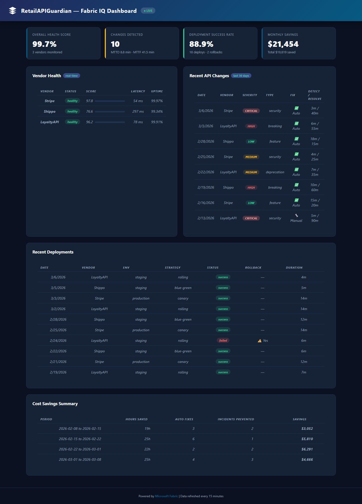
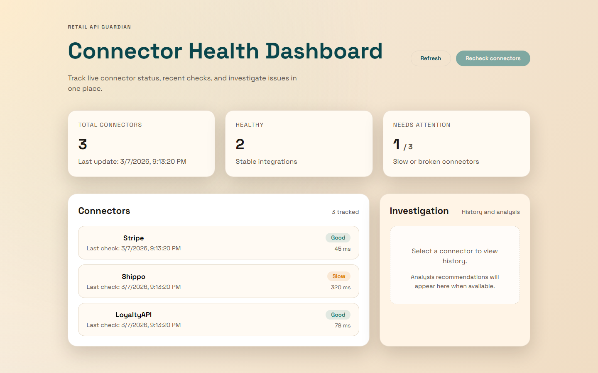
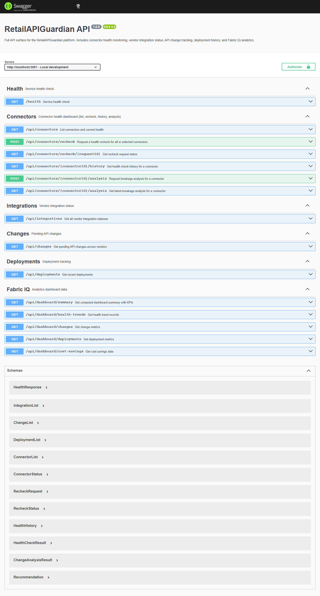

# RetailAPIGuardian

> **Omnichannel Retail API Integration Agent** — Never break an integration during Black Friday again.

[](https://github.com/sureshpaulraj/RetailAPIGuardian/actions)
[](LICENSE)

An agentic AI-powered integration platform built with the **GitHub Copilot SDK** that monitors vendor API changes, auto-generates adapter code, tests against sandboxes, and deploys with zero downtime — keeping retail integrations healthy 24/7.

---

## The Problem

Retail organizations juggle dozens of third-party API integrations — payment processors (Stripe, Adyen), shipping carriers (Shippo, EasyPost), loyalty platforms, POS systems, and marketing tools. When a vendor pushes a breaking API change, the result is:

- **Revenue loss** from failed payment flows during peak sales
- **Customer frustration** from broken order tracking or loyalty redemption
- **Engineering toil** from manually detecting changes, writing adapter code, testing, and deploying fixes

## The Solution

RetailAPIGuardian acts as an always-on **integration reliability platform** powered by the GitHub Copilot SDK. It:

1. **Detects** vendor API changes before they break production (changelog monitoring, OpenAPI spec diffing)
2. **Analyzes** impact across your integration stack with severity-ranked breakage reports
3. **Generates** updated TypeScript adapter code with retry logic, error handling, and backward compatibility
4. **Tests** generated code against vendor sandbox environments
5. **Deploys** validated changes with zero-downtime canary deployments and automatic rollback

---

## Screenshots

### Fabric IQ Analytics Dashboard
Real-time analytics showing overall health score, vendor status, API change timeline, and deployment history.



### Connector Health Dashboard (React)
Interactive connector management with live status monitoring, latency tracking, and investigation tools.



### OpenAPI Documentation (Swagger UI)
Interactive API explorer with full endpoint coverage, request/response schemas, and try-it-out functionality.



---

## Quick Start

### Prerequisites

- **Node.js 18+**
- **GitHub Copilot CLI** installed and authenticated (`copilot --version`)

### Install & Run

```bash
# Install dependencies
npm install

# Run the conversational agent (CLI)
npm start

# Run the dashboard server (Express API + embedded Fabric IQ dashboard)
npm run dashboard

# Run the React Connector Dashboard (Vite)
npm run dashboard:ui
```

### Verify

```bash
# Health check
curl http://localhost:3000/health

# Interactive API docs (Swagger UI)
open http://localhost:3000/api-docs

# Fabric IQ analytics dashboard
open http://localhost:3000/dashboard

# Run all tests (35 Playwright tests)
npm test
```

---

## Features

### Conversational Agent (Copilot SDK)

Built with `@github/copilot-sdk`, the agent provides a natural-language interface for integration management:

```
> check health
✅ Stripe: healthy (45ms latency, 0.1% error rate)
⚠️ Shippo: degraded (890ms latency, 2.3% error rate)
✅ LoyaltyAPI: healthy (120ms latency, 0.0% error rate)

> show changes
🔴 CRITICAL: LoyaltyAPI OAuth2 migration — deadline 2026-04-01
🟡 WARNING: Stripe payment_method field rename — v2026-03-15
🟢 INFO: Shippo added new carrier support
```

### Custom Agent Tools

| Tool | Description |
|------|-------------|
| `check_api_health` | Real-time health monitoring across all vendor integrations |
| `monitor_api_changes` | Detect breaking changes, deprecations, and security updates |
| `generate_adapter_code` | Produce updated TypeScript adapter code with enterprise patterns |
| `run_integration_tests` | Execute tests against vendor sandboxes |
| `deploy_changes` | Orchestrate zero-downtime deployments via GitHub Actions |

### Fabric IQ Analytics Dashboard

Embedded analytics dashboard at `/dashboard` providing:

- Overall reliability score across all integrations
- Health trend visualization over time
- Change detection timeline
- Deployment success/failure tracking
- Cost savings from automated remediation

### Connector Health Dashboard (React)

React-based frontend at `http://localhost:5173` showing:

- Real-time connector status (healthy/degraded/down)
- Latency and error rate monitoring
- Connector recheck workflows
- Historical health data and breakage analysis

### OpenAPI Documentation

- **Swagger UI**: Interactive API explorer at `/api-docs`
- **OpenAPI 3.0.3 Spec**: Raw spec at `/openapi.yaml`
- Full coverage of all REST endpoints with request/response schemas

---

## Architecture

```
┌─────────────────────────────────────────────────────────────────────────┐
│                         RetailAPIGuardian                               │
│                                                                         │
│  ┌───────────────┐   ┌─────────────────────┐   ┌────────────────────┐  │
│  │  API Monitor   │──▶│  Copilot SDK Agent   │──▶│  Code Generator    │  │
│  │                │   │  (Agentic Core)      │   │  (Custom Tools)    │  │
│  │ • Changelog    │   │ • Tool orchestration │   │ • Adapter updates  │  │
│  │   polling      │   │ • Impact analysis    │   │ • Test generation  │  │
│  │ • OpenAPI diff │   │ • Decision making    │   │ • PR creation      │  │
│  └───────────────┘   └─────────────────────┘   └────────────────────┘  │
│         │                      │                         │              │
│         ▼                      ▼                         ▼              │
│  ┌───────────────┐   ┌─────────────────────┐   ┌────────────────────┐  │
│  │ Express Server │   │ Fabric IQ Dashboard │   │ GitHub Actions     │  │
│  │ + Swagger UI   │   │ + React Frontend    │   │ (CI/CD Pipeline)   │  │
│  └───────────────┘   └─────────────────────┘   └────────────────────┘  │
│         │                      │                         │              │
│         ▼                      ▼                         ▼              │
│  ┌───────────────┐   ┌─────────────────────┐   ┌────────────────────┐  │
│  │ Azure Monitor  │   │ Azure Cosmos DB     │   │ Azure Key Vault    │  │
│  │ (Telemetry)    │   │ (State Store)       │   │ (Secrets)          │  │
│  └───────────────┘   └─────────────────────┘   └────────────────────┘  │
└─────────────────────────────────────────────────────────────────────────┘
```

See [docs/architecture.md](docs/architecture.md) for full component details and data flow diagrams.

---

## Project Structure

```
src/
├── agent/                    # Copilot SDK agent core
│   ├── index.ts              # Agent entry point
│   ├── tools/                # Custom agent tools (5 tools)
│   └── prompts/              # System prompts with retail domain context
├── integrations/             # Vendor adapter implementations
│   ├── stripe/               # Stripe payment adapter
│   ├── shippo/               # Shippo shipping adapter
│   └── loyalty-api/          # Custom loyalty platform adapter
├── fabriciq/                 # Fabric IQ analytics engine & dashboard
├── azure/                    # Azure service integrations
├── workiq/                   # Teams/email notification service
├── monitor/                  # API changelog watcher
└── server.ts                 # Express server (REST API + dashboards)
frontend/                     # React Connector Dashboard (Vite + TypeScript)
infra/                        # Azure Bicep IaC templates
├── main.bicep                # Root deployment template
├── modules/                  # VNet, App Service, Postgres, Redis, etc.
└── parameters/               # dev/staging/prod parameter files
tests/                        # Playwright test suites (35 tests)
├── api.spec.ts               # API endpoint tests (19 tests)
├── dashboard.spec.ts         # Dashboard UI tests (16 tests)
└── fixtures.ts               # Shared test fixtures
specs/                        # Feature specifications & contracts
docs/                         # Documentation & diagrams
```

---

## API Endpoints

| Method | Endpoint | Description |
|--------|----------|-------------|
| GET | `/health` | Service health check |
| GET | `/api/integrations` | List all vendor integrations |
| GET | `/api/changes` | Detected API changes ranked by severity |
| GET | `/api/deployments` | Deployment history |
| GET | `/api/connectors` | Connector health status |
| POST | `/api/connectors/recheck` | Trigger connector health recheck |
| GET | `/api/connectors/:id/history` | Connector health history |
| POST | `/api/connectors/:id/analysis` | Run breakage analysis |
| GET | `/dashboard` | Fabric IQ analytics dashboard (HTML) |
| GET | `/api-docs` | Swagger UI interactive docs |
| GET | `/openapi.yaml` | OpenAPI 3.0.3 specification |

---

## Testing

```bash
# Run all 35 tests
npm test

# Run API tests only (19 tests)
npm run test:api

# Run dashboard tests only (16 tests)
npm run test:dashboard
```

Tests use Playwright with a custom fixture that spins up the Express server on a random port for isolation.

---

## Azure Deployment

Full Bicep IaC templates are provided in [`infra/`](infra/README.md) for deploying to Azure:

- **App Service** (Node.js 18 LTS) with VNet integration
- **PostgreSQL Flexible Server** with private endpoint
- **Azure Cache for Redis** with private endpoint
- **Key Vault** for secrets management
- **Application Gateway** with WAF
- **Application Insights** for monitoring
- **Private DNS Zones** for secure service resolution

```bash
az login
az account set --subscription <subscription-id>
az group create --name <rg-name> --location eastus

az deployment group create \
  --resource-group <rg-name> \
  --template-file infra/main.bicep \
  --parameters infra/parameters/dev.json
```

CI/CD pipeline in [`.github/workflows/ci.yml`](.github/workflows/ci.yml) automates lint → test → deploy-staging → deploy-production.

---

## Documentation

| Document | Description |
|----------|-------------|
| [docs/README.md](docs/README.md) | Full documentation — problem, solution, setup |
| [docs/architecture.md](docs/architecture.md) | System architecture & data flow diagrams |
| [docs/rai-notes.md](docs/rai-notes.md) | Responsible AI considerations & guardrails |
| [docs/demo-script.md](docs/demo-script.md) | Demo walkthrough script |
| [specs/001-retail-api-guardian/spec.md](specs/001-retail-api-guardian/spec.md) | Feature specification with user stories |
| [AGENTS.md](AGENTS.md) | Custom Copilot agent instructions |

---

## Tech Stack

- **Runtime**: Node.js 18+ / TypeScript 5.9
- **Agent Framework**: GitHub Copilot SDK (`@github/copilot-sdk`)
- **Backend**: Express 5.x with OpenAPI 3.0.3
- **Frontend**: React + Vite + TypeScript
- **Testing**: Playwright (API + UI)
- **Infrastructure**: Azure Bicep (App Service, PostgreSQL, Redis, Key Vault, App Gateway)
- **CI/CD**: GitHub Actions
- **API Docs**: Swagger UI

---

## Challenge Submission

Built for the **GHCSDK Enterprise Challenge (Q3 FY26)** — showcasing enterprise-grade retail integration management powered by the GitHub Copilot SDK.

**Key differentiators:**
- End-to-end agentic workflow from detection → analysis → code generation → testing → deployment
- Dual dashboard experience (Fabric IQ analytics + React connector management)
- Full OpenAPI compliance with interactive Swagger UI docs
- Enterprise-ready Azure IaC with VNet isolation, private endpoints, and Key Vault
- 35 automated Playwright tests covering API and dashboard functionality

## License

MIT
